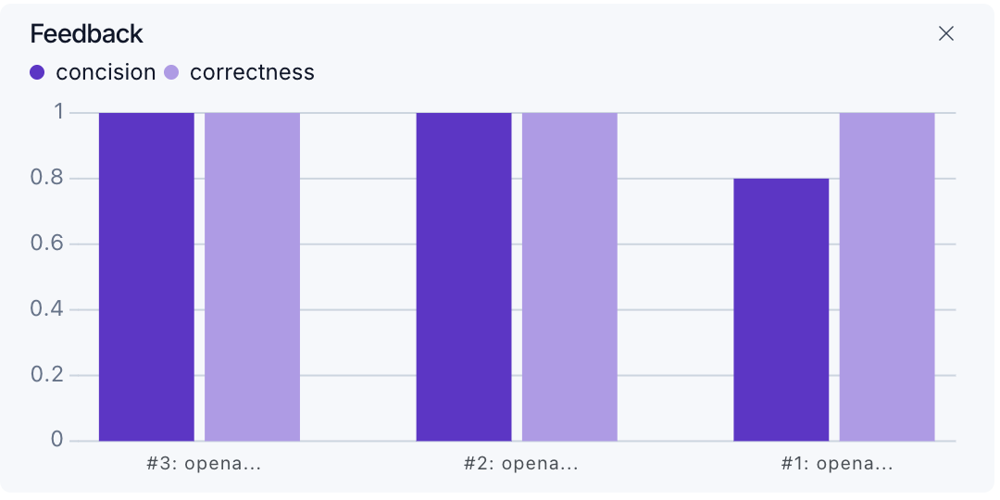
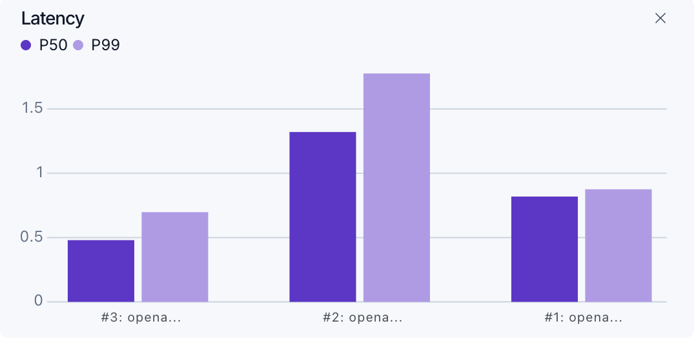
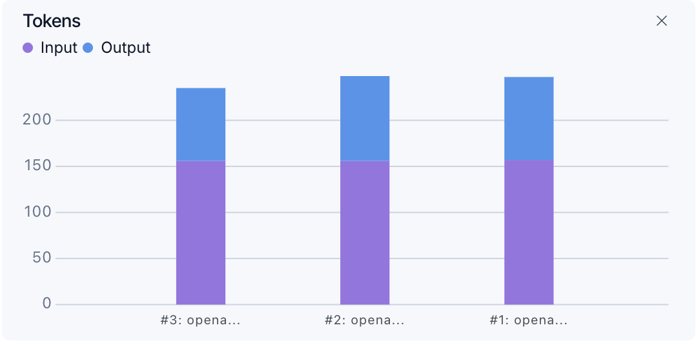
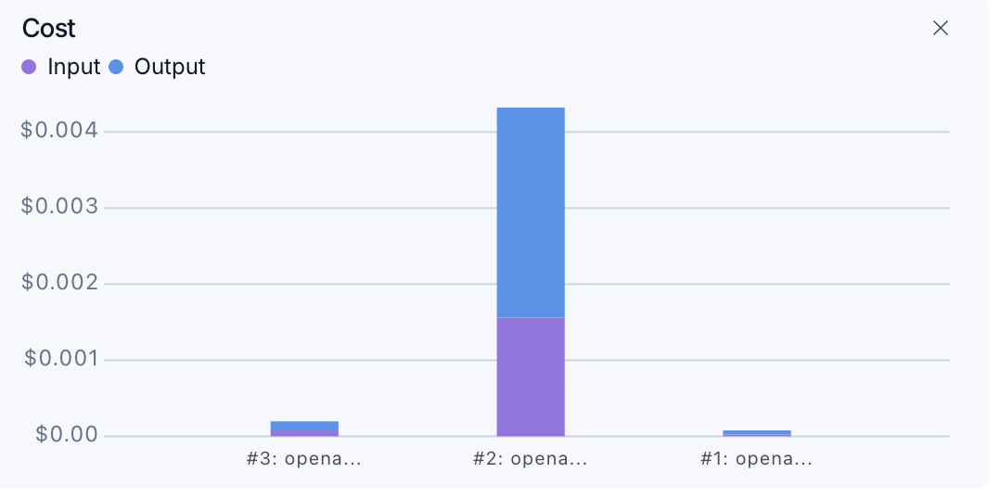
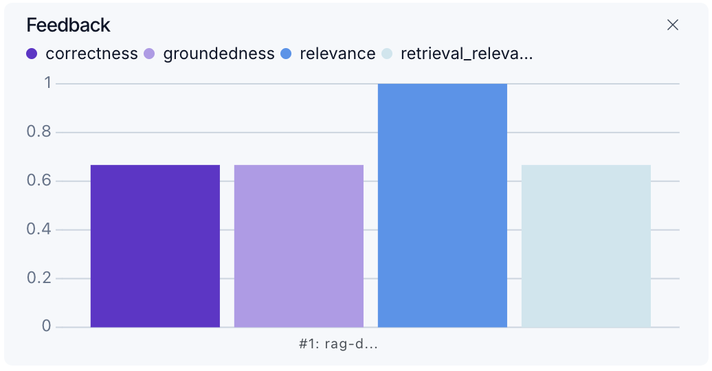
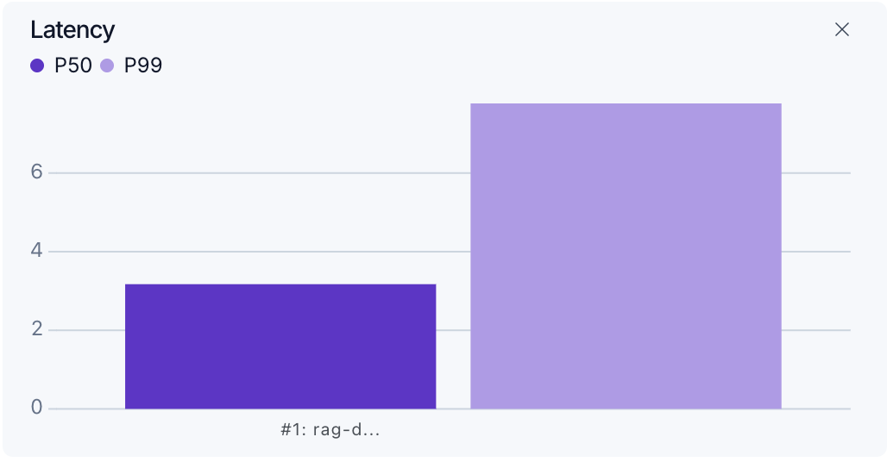
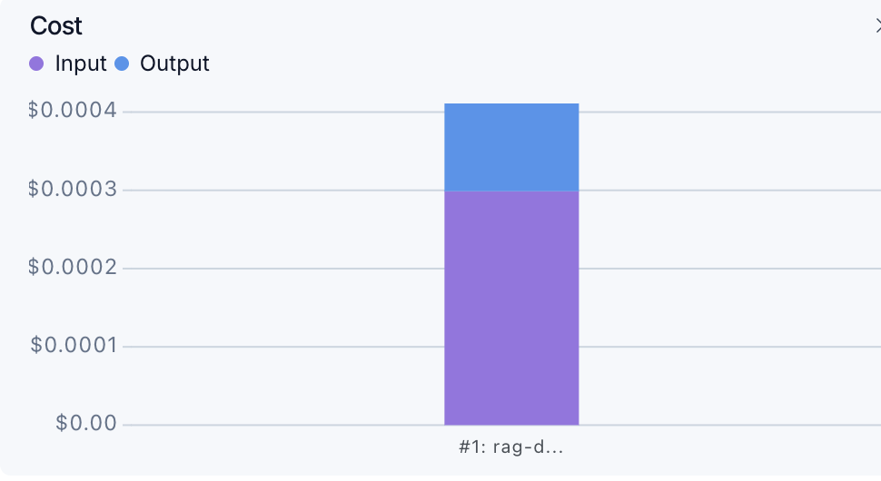

# Chatbot & RAG Evaluation with LangSmith

Evaluating a standard chatbot and a Retrieval-Augmented Generation (RAG) chatbot using LangSmith and LLM-as-a-judge scoring.

## Stack
Python · LangChain · LangSmith · OpenAI · uv

## Setup

```bash
uv venv rag_env && source rag_env/bin/activate
uv pip install -r requirements.txt
uv pip install ipykernel
```

And add a ```.env.example``` file to your repo:

```bash
export LANGCHAIN_API_KEY=your_key
export OPENAI_API_KEY=your_key
export LANGCHAIN_TRACING_V2=true
```

> Get your LangSmith API key at [smith.langchain.com](https://smith.langchain.com)

---

## Part 1 — Chatbot Evaluation

Standard LLM chatbot evaluated against ground truth Q&A pairs stored in LangSmith. A wrapper traces every OpenAI call per experiment.

| Metric | Measures |
|---|---|
| Correctness | Factual accuracy vs ground truth |
| Answer Length | Answer length < 2× actual |

### Results

| | | |
|---|---|---|
|  |  |  |
|  |  | |

---

## Part 2 — RAG Chatbot Evaluation

**Data Ingestion → Retriever (Vector Search) → LLM Generation**

Extends the baseline with retrieval — documents are ingested, chunked, and stored in a vector store. The retriever fetches relevant context before generation.

| Metric | Measures |
|---|---|
| Correctness | Factual accuracy vs ground truth |
| Groundedness | Answer supported by retrieved docs |
| Relevance | Answer addresses the question |
| Retrieval Relevance | Quality of retrieved documents |

> LangSmith has no built-in judge — all evaluation logic is custom, using an LLM inside each evaluator.

### Results

| | | |
|---|---|---|
|  |  |  |
|  |  | |

---

## Why uv?
Global package cache with hard-linking — isolated envs without disk duplication, 10–100× faster than pip.
